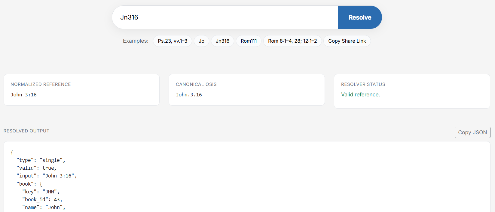

# BibleBridge Reference Resolver

Resolve messy Bible references into canonical coordinates:



Deterministic Bible reference resolution that produces canonical coordinates and OSIS identifiers, powered by the **BibleBridge Deterministic Reference Integrity Engine**.

BibleBridge converts human-written Scripture references into deterministic canonical coordinates and OSIS identifiers that software can reliably store, index, and expand.

BibleBridge provides a canonical Scripture reference pipeline:

**/resolve** → normalize flexible Scripture references  
**/expand** → expand canonical spans into verse coordinates  
**/context** → traverse surrounding verses using canonical verse indexes

Once expanded into canonical coordinates, Scripture becomes structured, traversable data.

---

## What This Enables
Once Scripture references are normalized and expanded into canonical coordinates, developers can treat the Bible as structured data instead of text. This enables capabilities that are difficult or unreliable with traditional Bible APIs, including:

* Deterministic Scripture indexing
* AI-driven reference validation
* Cross-chapter and cross-book traversal
* Scripture graph generation
* Canonically stable document linking
* Structured storage of references in databases

## Example Workflow
* **Resolve** user-written references
* **Expand** them into verse coordinates
* **Store** them as canonical identifiers
* **Traverse** adjacent verses using verse indexes
* **Retrieve** any translation later

Because the coordinate system is canonical and **version-agnostic**, references remain stable across translations and systems.

---

## Try the Resolver (No API Key Required)
The resolver playground can be used immediately — no signup or API key required.

https://holybible.dev/resolve-playground

Example input:

Ps.23, vv.1–3

Example response:

```json
{
  "type": "single",
  "valid": true,
  "input": "ps 23:1-3",
  "book": {
    "key": "PSA",
    "book_id": 19,
    "name": "Psalm",
    "slug": "psalm"
  },
  "spans": [
    {
      "start": {
        "chapter": 23,
        "verse": 1
      },
      "end": {
        "chapter": 23,
        "verse": 3
      }
    }
  ],
  "osis_id": "Ps.23.1-Ps.23.3",
  "confidence": 0.984
}
```

Real-world compound reference example:

rom 8:1-4, 28; 12:1-2; john 3:16; ps 23; 1 cor 13:4-7

BibleBridge can resolve compound references spanning multiple books, chapters, and verse ranges.

## Why BibleBridge

Bible references written by humans are inconsistent, ambiguous, and highly variable.

Examples:
```
Jn316
Rom 8:1-4, 28
Ps.23, vv.1–3
1 Cor 13 kjv
```

Many applications attempt to parse Bible references using regular expressions. As real-world input introduces ambiguity and edge cases, these parsers become increasingly complex to maintain.

Edge cases multiply, test suites grow, and the parser eventually becomes its own subsystem.

Most developers don’t want to build or maintain a scripture reference parser.

BibleBridge removes that responsibility by providing deterministic reference resolution as infrastructure.

BibleBridge uses the Deterministic Reference Integrity Engine to convert unpredictable references into structured canonical coordinates.

The resolver produces canonical coordinates and OSIS identifiers with deterministic behavior across search, linking, indexing, and retrieval workflows.

This allows developers to reliably:
* resolve Bible references
* generate OSIS identifiers
* index and link scripture references
* power search and study tools
* process references generated by AI systems

## API
BibleBridge is available as a production API for deterministic Scripture reference resolution and canonical coordinate expansion.

API Documentation:

https://holybible.dev/api-docs

A free tier is available for development and evaluation.

## License
Copyright © 2026 BibleBridge. All rights reserved.
